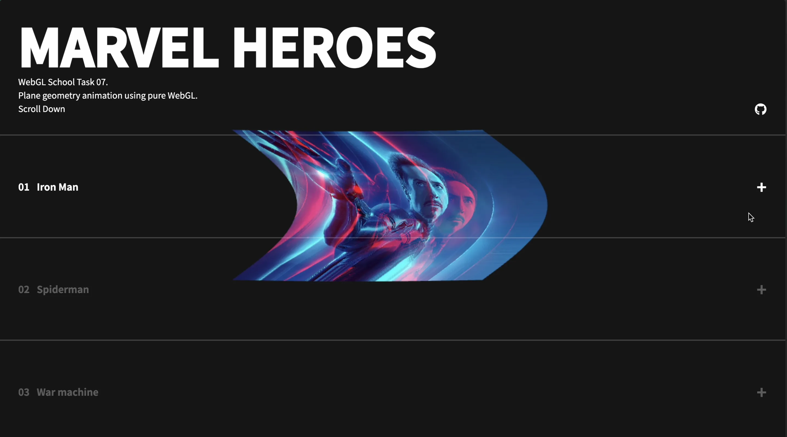
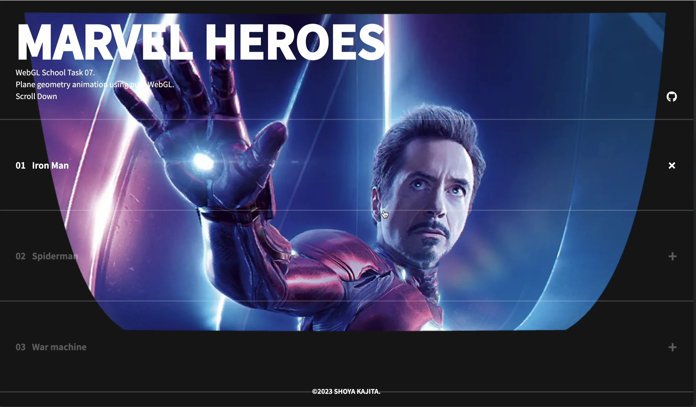
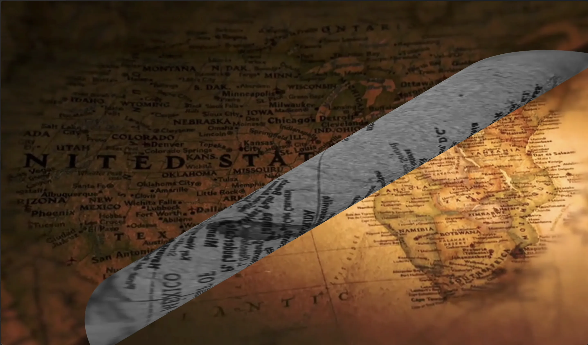
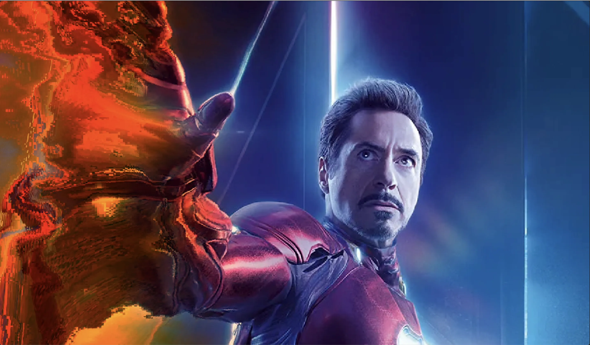

# Toys.029 | WebGL School Task.07 ~ Plane geometry animation using pure WebGL.

## 🪬 ~ 要件
- テクスチャを複数同時に利用する実装に挑戦してみましょう。
※ 生 WebGL で実装すること


## 👾 ~ Demo


- https://dev.shoya-kajita.com/029/









## 🎮 ~ Getting Started

```
// install
npm i

// development
npm run dev

// production
npm run build

// build preview
npm run preview
```

## 📝 ~ Note

### matcap

- https://github.com/hughsk/matcap

```glsl
// vec3 eye: the camera's current position.
// vec3 normal: the surface's normal vector.

vec2 matcap(vec3 eye, vec3 normal) {
  vec3 reflected = reflect(eye, normal);
  float m = 2.8284271247461903 * sqrt( reflected.z+1.0 );
  return reflected.xy / m + 0.5;
}
```
